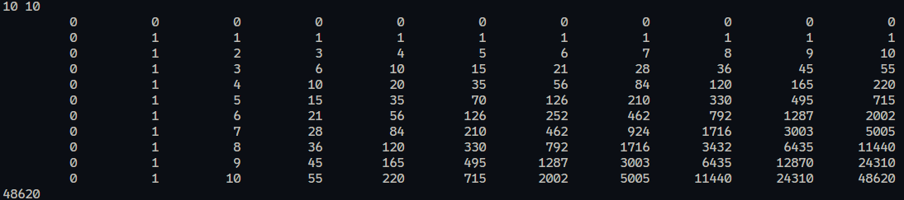
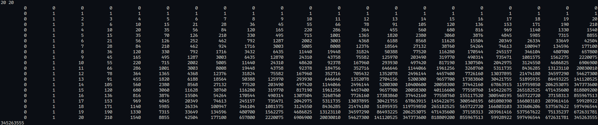

# 1 题目描述：
- 二维斐波那契波动数列满足以下递推式：
$$
\begin{cases}
a_{i,j} = 1, & (i,j \in \{1\}) \\[4pt]
a_{i,j} = a_{i-1, j}, & (2 \le i, \; j \in \{1\}) \\[4pt]
a_{i,j} = a_{i, j-1}, & (2 \le j, \; i \in \{1\}) \\[4pt]
a_{i,j} = a_{i-1, j} + a_{i, j-1}, & (2 \le i, j)
\end{cases}
$$

- 给定正整数 $n, m$，求 $a_{n,m}$ 的值。由于结果可能很大，请输出 $a_{n,m}$ 对 $10^9 + 7$ 取模后的结果。

## 1.1 输入描述 
- 在一行中输入两个正整数 $n, m$ $(1 \le n, m \le 10^3)$，分别表示行下标和列下标。

## 1.2 输出描述  
- 输出一个整数，表示 $a_{n,m} \bmod (10^9 + 7)$ 的值。
# 2 解析
## 2.1 问题与输入/输出
- 输入：正整数 $n, m (1 ≤ n, m ≤ 1000)$。
- 输出：按题中递推式定义的 $a_{n,m}$ 对 $10^9+7$ 取模的值。
- 正常成功条件：返回非负整数 $< 10^9+7$。
- 错误模式：输入不合法（题目里不考虑），n 或 m 极端值（1）是合理情况。
## 2.2 数学解析（组合数推导）
- $a_{1,1} = 1$；
- $a_{i,j} = a_{i-1, j}$,  $(2 \le i, \; j \in \{1\})$
    - 有 $a_{2,1} = a_{1, 1}$，$a_{3,1} = a_{2, 1}$，$a_{4,1} = a_{3, 1}$，... $a_{n,1} = a_{n-1, 1}$ 即第1列全部为1
- $a_{i,j} = a_{i, j-1}$,  $(2 \le j, \; i \in \{1\})$
    - 有 $a_{1,2} = a_{1, 1}$，$a_{1,3} = a_{1, 2}$，$a_{1,4} = a_{1, 3}$，... $a_{1,n} = a_{1, n-1}$ 即第1行全部为1
- $i,j ≥ 2$：$a_{i,j} = a_{i-1,j} + a_{i,j-1}$
    - 总结规律： $a_{i,j}$ = 上一行，同列元素 + 同行，上一列元素
$$
\left[
\begin{matrix}
0 & 0 & 0 & 0 & 0 &\cdots & 0\\
0 & 1 & 1 & 1 & 1 &\cdots & 1\\
0 & 1 & 2 & 3 & 4 &\cdots & \cdots\\
0 & 1 & 3 & 6 & 10 &\cdots & \cdots\\
0 & 1 & 4 & 10 & 20 &\cdots & \cdots\\
\vdots & \vdots & \vdots & \vdots & \vdots & \vdots& \vdots\\
0 & 1 & \cdots & \cdots &\cdots &\cdots &\cdots &
\end{matrix}
\right]
$$

# 实现 
```c
#include <stdio.h>

typedef long long ll;
const ll MOD = 1000000007LL;

/* 静态二维数组上限（按需调整）。
   说明：(MAX_N+1)*(MAX_M+1) * 8 字节 大小为数组占用字节数。
   例如 MAX_N=MAX_M=1000 时占用约 8MB，通常是可接受的。
   如果题目 n,m 非常大（例如 10^5），应使用组合公式或动态分配+滚动数组。 */
#define MAX_N 1000
#define MAX_M 1000

static ll dp[MAX_N + 1][MAX_M + 1];

int main(void) {
    int n, m;
    if (scanf("%d %d", &n, &m) != 2) return 0;

    if (n <= 0 || m <= 0) {
        printf("0\n");
        return 0;
    }

    if (n > MAX_N || m > MAX_M) {
        fprintf(stderr,
            "错误: 输入超出程序预设上限 (n <= %d, m <= %d)。\n"
            "可将 MAX_N/M 增大或使用更节省内存的实现（如一维滚动数组或组合公式）。\n",
            MAX_N, MAX_M);
        return 1;
    }

    /* 初始化第一行与第一列为 1（仅有一条路径） */
    for (int i = 1; i <= n; ++i) dp[i][1] = 1;
    for (int j = 1; j <= m; ++j) dp[1][j] = 1;

    /* 填表：从 (2,2) 到 (n,m) */
    for (int i = 2; i <= n; ++i) {
        for (int j = 2; j <= m; ++j) {
            dp[i][j] = (dp[i-1][j] + dp[i][j-1]) % MOD;
        }
    }

    for (int i = 0; i <= n; ++i) {
        for (int j = 0; j <= m; ++j) {
            printf("%10lld ", dp[i][j]);
        }
        printf("\n");
    }

    printf("%lld\n", dp[n][m]);
    return 0;
}

```

## 执行结果



