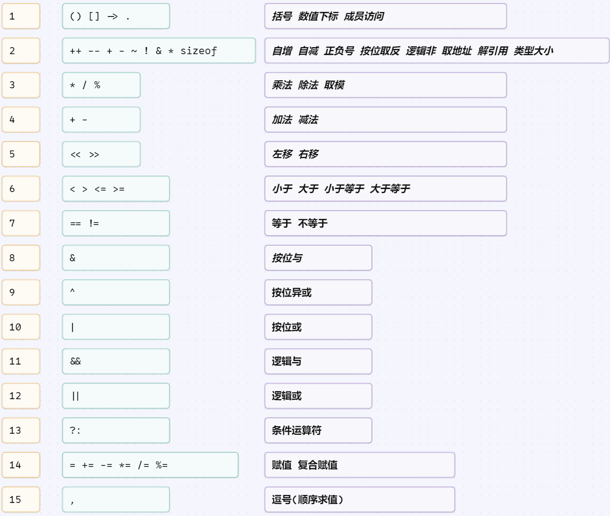

# 一 选择题
## 1
- 改正下列程序中_________处错误后，程序的运行结果是在屏幕上显示短语"Welcome to You!"。
```c
#include <stdio.h>
int main(void)
{
    printf(Welcome to You!\n")
    return 0;
}
```
<br/> A. 1 <br/> B. 2 <br/> C. 3 <br/> D. 4

```
答案：B
解释：
    1. 字符串需要包含在一对双引号""间
    2. C语言中的语句都需要以分号;结束
```
## 2
- C语言表达式_______的值不等于1。
<br/>A. `123/100` <br/> B. `901%10` <br/> C. `76%3` <br/> D. `625%5`

```
答案：D
```
验证：
```c
#include <stdio.h>
int main(void){
    printf("123/100=%d\n", 123/100);
    printf("901%%10=%d\n", 901%10);
    printf("76%%3=%d\n", 76%3);
    printf("625%%5=%d\n", 625%5);
    return 0;
}
```
> 由于在printf的格式化串中，`%` 具有特殊意义，如果需要打印出字面义的 `%`，则需要使用 `%%` 表示
- 输出结果
```shell
123/100=1
901%10=1
76%3=1
625%5=0
```
## 3
- 假设 i 和 j 是整型变量， 以下语句_______的功能是在屏幕上显示形如 i * j=i * j 的一句乘法口诀。例如，当 i = 2, j = 3 时， 显示 2 * 3=6。
<br/>A. `printf("d * %d=%d\n", i, j, i * j);` 
<br/>B. `printf("%d * %d=%d\n", i, j, i * j);` 
<br/>C. `printf("%d * %d=%d\n", i, j);`
<br/>D. `printf("%d=%d * %d\n", i, j, i * j);` 

```
答案：B
```
## 4
- 若 x 是 double型变量， n是int型变量， 执行以下语句________, 并输入3 1.25后，x=1.25，n=3。
<br/>A. `scanf("%d%lf", &n, &x);` 
<br/>B. `scanf("%lf%d", &x, &n);` 
<br/>C. `scanf("%lf%d", &n, &x);`
<br/>D. `scanf("%d,%lf", &n, &x);`

```
答案：A
解释：
    "%d%lf": 如此表达等价于"%d %lf", 即在输入多个数据之间以空格分隔
    "%d,%lf"：如此表达时，在输入多个数据间需要按照格式化串中给定的分隔符分隔，例如这里的 逗号,
    由于题目指明了输入的数据顺序为 3 1.25，因此B不对，如果题目指明输入数据为 1.25 3 的话，那么答案就应当选择B
```
## 5
- 下列运算符中，优先级最低的是________。
<br/>A. `*` 
<br/>B. `=` 
<br/>C. `==`
<br/>D. `%`

```
答案：B
```
<div style="text-align: center;">

</div>

## 6
- 将以下if-else语句补充 完整， 正确的选项是________。
    ```c
    if(x>=y){
        printf("max=%d\n", x);
    ________
        printf("max=%d\n", y);
    }
    ```
<br/>A. `else;` 
<br/>B. `else{` 
<br/>C. `}else{`
<br/>D. `else`

```
答案：C
```
- 对比if-else语句应有的结构
```c
//结构1：
if(condition)
    单条语句;
else
    单条语句;
```
```c
//结构2
if(condition){
    单条或多条语句;
}else{
    单条或多条语句;
}
```
## 7
- 为了检查第6题的if-else语句的两个分支是否正确，至少需要设计3组测试用例，其相应的输入数据和预期输出结果是________。
<br/>A. 输入 3 和 4， 输出 4；输入 5 和 100，输出 100；输入 4 和 3，输出4。 
<br/>B. 输入 3 和 4， 输出 4；输入 100 和 5，输出 100；输入 4 和 3，输出4。 
<br/>C. 输入 3 和 4， 输出 4；输入 5 和 5，输出 5；输入 -2 和 -1，输出-1。
<br/>D. 输入 3 和 4， 输出 4；输入 5 和 5，输出 5；输入 4 和 3，输出4。

```
答案：D
解释：
    所谓测试，就是要验证了所有可能的值，程序输出的结果都是符合预期的结果
    例如在第6题中，分支语句的判断条件是 x >= y，因此我们需要测试3种可能的情况
        情况1. x 大于 y 时 结果应该是x
        情况2. x 小于 y 时 结果应该是y
        情况3. x 等于 y 时 结果应该是x
```
## 8
- 对C语言程序，以下说法正确的是________。
<br/>A. main函数是主函数，一定要写在最前面。 
<br/>B. 所有的自定义函数，都必须先声明。 
<br/>C. 程序总是从main函数开始执行的。
<br/>D. 程序中只能调用库函数，不能自己定义函数。

```
答案：C
解释：
    A. main函数是C语言程序的主函数，但不一定要写在最前面，其前面可以定义全局变量，自定义函数等
    B. 如果自定义函数放置于其被调用位置之前，就不用声明
        - 如加入定义了一个函数f1()，其定义放置于main函数之前，那么就无需声明f1()函数
        - 如加入定义了一个函数f2()，其定义放置于main函数之后，那么就需要在main函数内部或之前声明函数f2(), 具体情况请参考后面的例程
    C. main函数是C程序的主入口函数，任何C程序执行时都是从main函数开始执行的
    D. C程序中可以使用两种函数
        一种为库函数(C编译器，或第3方提供的预先定义好的函数) 
        一种为程序员根据自己的需求，自己定义的函数
```
```c
// 子定义函数的定义与声明示例
#include <stdio.h>
// 函数定义
void f1(){
    printf("I am f1()\n");
}
// 函数声明
void f2();

int main(void){
    f1();
    f2();
    return 0;
}
// 函数定义
void f2(){
    printf("I am f2()\n");
}
```